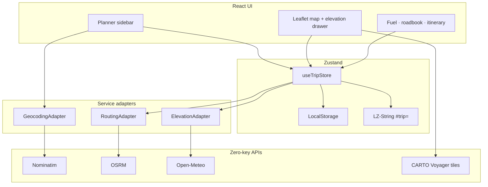

# Wayfare

[](https://github.com/sidehustlesallam/Wayfare/actions/workflows/deploy.yml)
[](./LICENSE)
[](https://react.dev/)
[](https://vitejs.dev/)
[](https://tailwindcss.com/)
[](https://vite-pwa-org.netlify.app/)

**Live demo:** [https://sidehustlesallam.github.io/Wayfare/](https://sidehustlesallam.github.io/Wayfare/)

Wayfare is a zero-cost, client-side road trip planner for multi-stop, long-distance, and international drives. It prioritizes driveability — daily driving caps, scenic vs fastest routing, fuel estimates, border logistics, elevation alerts, and shareable itineraries — using open, zero-key APIs. No backend required. Install it as a PWA to keep saved trips available offline.

## Features

- **Multi-stop routing** — Drag-and-drop waypoints, must-visit vs overnight, reverse / clear
- **English basemap** — CARTO Voyager labels by default (OSM Standard via `customMapTiles`)
- **Scenic vs fastest** — Motorway-preferring routes or secondary-road scenic profile
- **Daily driving caps** — Amber over-cap polylines to the destination + hoverable stopover insert (drive time from start)
- **Border awareness** — Mid-route country sampling with 🛂 badges + vignette / passport / driving-side / currency alerts
- **Fuel & cost** — Metric / imperial live totals from route distance
- **Elevation profile** — Open-Meteo sampling, hover marker, mountain-pass alerts (≥1800 m)
- **Roadbook export** — TXT instructions, print/PDF, GPX (flag-gated)
- **Share & persist** — LocalStorage + LZ-String `#trip=` links + Open Graph cards
- **PWA** — Installable shell with offline assets and saved itineraries

## Architecture

Service adapters keep UI free of provider lock-in (see [`Tech_Stack.md`](./Tech_Stack.md)):



```
src/
├── components/   # common · map · planner · widget
├── config/       # feature flags, defaults, map tile resolver
├── hooks/        # useRouting · useGeocoding · useElevationProfile · …
├── services/     # Nominatim · OSRM · Open-Meteo adapters
├── store/        # useTripStore
├── test/         # Vitest setup + Leaflet mocks
├── types/        # shared TypeScript models
└── utils/        # polyline · fuel · borders · elevation · roadbook · tripShare
```

## Quickstart

```bash
npm install
npm run dev
```

Open the local Vite URL (usually `http://localhost:5173`).

### Scripts

| Command | Purpose |
| --- | --- |
| `npm run dev` | Local development server |
| `npm run test` | Run Vitest suite once |
| `npm run test:watch` | Vitest watch mode |
| `npm run build` | Typecheck + production build → `dist/` |
| `npm run preview` | Preview the production build (includes PWA) |
| `npm run lint` | ESLint |

## Feature flags

Configured in [`src/config/features.ts`](./src/config/features.ts):

| Flag | Default | Effect |
| --- | --- | --- |
| `gpxExport` | on | Show GPX download in Roadbook |
| `scenicRouting` | on | Show fastest / scenic profile toggle |
| `customMapTiles` | off | Use OSM Standard instead of CARTO Voyager |
| `aiItinerary` | off | Reserved |

## Deploy (GitHub Pages)

1. Repo **Settings → Pages → Source: GitHub Actions**
2. Push to `main` (or run the workflow manually)

`.github/workflows/deploy.yml` runs **tests**, builds the SPA, and publishes `dist/`.

**Demo:** [sidehustlesallam.github.io/Wayfare](https://sidehustlesallam.github.io/Wayfare/)

## PWA & offline

`vite-plugin-pwa` registers a service worker that:

- Precaches the app shell (HTML/JS/CSS/icons)
- Cache-first for map tiles and fonts
- Network-first for OSRM / Nominatim / elevation
- Keeps Zustand LocalStorage itineraries available offline

Use the browser install prompt (or “Add to Home Screen”) on HTTPS / GitHub Pages.

## Specs & agent context

- [`PRD.md`](./PRD.md) — product requirements (current shipped scope)
- [`Tech_Stack.md`](./Tech_Stack.md) — stack, adapters, data models
- [`Project Standards.md`](./Project%20Standards.md) — coding rules
- [`AGENTS.md`](./AGENTS.md) — context guide for coding agents

## Attribution

Map data © [OpenStreetMap](https://www.openstreetmap.org/copyright) contributors. Tiles © [CARTO](https://carto.com/attributions). Routing via [OSRM](http://project-osrm.org/); geocoding via [Photon](https://photon.komoot.io/) / [Nominatim](https://nominatim.org/); elevation via [Open-Meteo](https://open-meteo.com/). Please respect public API usage policies.

## License

[MIT](./LICENSE)
