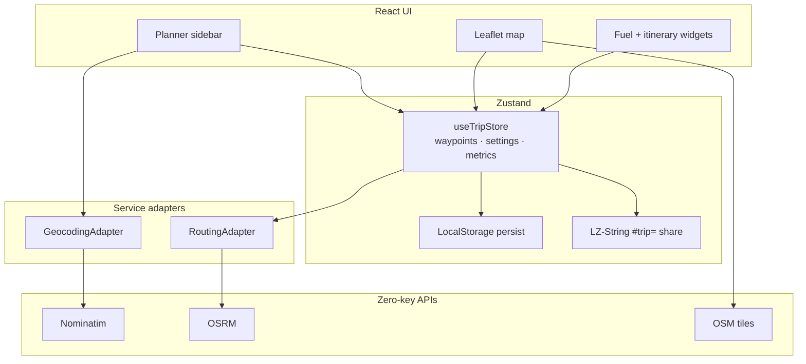

# Wayfare

[](https://github.com/sidehustlesallam/Wayfare/actions/workflows/deploy.yml)
[](./LICENSE)
[](https://react.dev/)
[](https://vitejs.dev/)
[](https://tailwindcss.com/)
[](https://vite-pwa-org.netlify.app/)

**Live demo:** [https://sidehustlesallam.github.io/Wayfare/](https://sidehustlesallam.github.io/Wayfare/)

Wayfare is a zero-cost, client-side road trip planner for multi-stop, long-distance, and international drives. It prioritizes driveability — daily driving caps, fuel estimates, border logistics, and shareable itineraries — using open, zero-key mapping APIs. No backend required. Install it as a PWA to keep saved trips available offline.

## Features

- **Multi-stop routing** — Add, reorder, and remove waypoints (must-visit vs overnight)
- **Daily driving caps** — Amber over-cap polylines plus midpoint stopover suggestions
- **Fuel & cost estimator** — Metric / imperial units with live totals from route distance
- **Border awareness** — Vignette, passport, driving-side, and currency reminders
- **Share & persist** — LocalStorage sessions plus LZ-String `#trip=` share links
- **Itinerary export** — Day-by-day playbook with print / Save as PDF
- **PWA** — Installable app shell with offline access to cached assets and saved trips

## Architecture

Service adapters keep UI code free of provider lock-in (see [`Tech_Stack.md`](./Tech_Stack.md)):



```
src/
├── components/   # common · map · planner · widget
├── config/       # feature flags & defaults
├── hooks/        # useRouting · useGeocoding · useBorderDetection · …
├── services/     # Nominatim & OSRM adapters
├── store/        # useTripStore
├── types/        # shared TypeScript models
└── utils/        # polyline · fuel · borders · trip URL encode/decode
```

## Quickstart

```bash
npm install
npm run dev
```

Open the local Vite URL (usually `http://localhost:5173`).

### Scripts

| Command | Purpose |
| --- | --- |
| `npm run dev` | Local development server |
| `npm run test` | Run Vitest suite once |
| `npm run test:watch` | Vitest watch mode |
| `npm run build` | Typecheck + production build → `dist/` |
| `npm run preview` | Preview the production build |
| `npm run lint` | ESLint |

## Deploy (GitHub Pages)

1. Repo **Settings → Pages → Source: GitHub Actions**
2. Push to `main` (or run the workflow manually)

`.github/workflows/deploy.yml` runs tests, builds the SPA, and publishes `dist/`. Vite uses `base: './'` so assets resolve on project Pages URLs.

**Demo:** [sidehustlesallam.github.io/Wayfare](https://sidehustlesallam.github.io/Wayfare/)

## PWA & offline

`vite-plugin-pwa` registers a service worker that:

- Precaches the app shell (HTML/JS/CSS/icons)
- Cache-first for OSM tiles and fonts
- Network-first for OSRM / Nominatim (with short-lived fallback cache)
- Keeps Zustand LocalStorage itineraries available when offline

Use the browser install prompt (or “Add to Home Screen”) after deploying over HTTPS / GitHub Pages.

## Specs

- [`PRD.md`](./PRD.md) — product requirements
- [`Tech_Stack.md`](./Tech_Stack.md) — stack & adapters
- [`Project Standards.md`](./Project%20Standards.md) — coding rules

## Attribution

Map data © [OpenStreetMap](https://www.openstreetmap.org/copyright) contributors. Routing via [OSRM](http://project-osrm.org/); geocoding via [Nominatim](https://nominatim.org/). Please respect public API usage policies when developing against them.

## License

[MIT](./LICENSE)
